# KlarKI — Full Pipeline Architecture

> Render this file in VS Code with the **Mermaid Preview** extension, or paste the diagram block at [mermaid.live](https://mermaid.live).

```mermaid
flowchart TD
    classDef io       fill:#0d2137,stroke:#4a90d9,color:#cce4ff,font-weight:bold
    classDef proc     fill:#0d2a18,stroke:#3aad5e,color:#c8f0d8
    classDef ml       fill:#1e0d2a,stroke:#9b59b6,color:#e8d5f5
    classDef legal    fill:#2a1e0d,stroke:#d4a017,color:#f5e8c8
    classDef rag      fill:#0d1e2a,stroke:#2e86c1,color:#c8dff0
    classDef agent    fill:#1e0d1e,stroke:#c0392b,color:#f5c8c8
    classDef score    fill:#0d2a2a,stroke:#17a589,color:#c8f0ee
    classDef gate     fill:#2a0d0d,stroke:#e74c3c,color:#fdd
    classDef store    fill:#1e1e0d,stroke:#f39c12,color:#fef9c3
    classDef note     fill:#1a1a1a,stroke:#555,color:#aaa,font-style:italic

    %% ─────────────────────────────────────────────────────────
    %% INPUT
    %% ─────────────────────────────────────────────────────────
    UPLOAD(["📄 Document Upload
    PDF · DOCX · TXT · MD
    max 10 MB"]):::io

    %% ─────────────────────────────────────────────────────────
    %% STAGE 1 — INGESTION
    %% ─────────────────────────────────────────────────────────
    subgraph ING["① INGESTION  (sequential)"]
        direction TB
        PARSE["🔍 Parse
        PyMuPDF → prose text
        pdfplumber → table rows
        pytesseract → OCR for scanned PDFs"]:::proc

        CHUNK["✂️ Proposition Chunking
        RecursiveCharacterTextSplitter
        512 chars · 50 char overlap
        heading-aware · colon-list split
        each chunk → UUID4 + section metadata
        ──────────────────────
        ~80–120 chunks for a 20-page doc"]:::proc

        LANG["🌐 Language Detection
        langdetect → 'en' | 'de'
        fallback to 'en' for text < 100 chars
        language stamped on every chunk"]:::proc

        NER1["🏷️ NER Phase 1 — Entity Extraction
        spaCy de_core_news_lg
        runs on ALL chunks (capped at 1000 chars each)
        ──────────────────────────────────────
        Extracts 8 entity types per chunk:
        PROHIBITED_USE  · RISK_TIER  · AI_SYSTEM
        ARTICLE  · ACTOR  · OBLIGATION
        PROCEDURE  · REGULATION
        ──────────────────────────────────────
        Writes → chunk.metadata.ner_entities
        Does NOT touch chunk.domain yet"]:::ml

        PARSE --> CHUNK --> LANG --> NER1
    end

    %% ─────────────────────────────────────────────────────────
    %% STAGE 2 — LEGAL GATE
    %% ─────────────────────────────────────────────────────────
    subgraph LEGAL["② LEGAL GATE  (asyncio.gather — both tasks run at the same time)"]
        direction LR

        ACTOR["👤 Actor Classification
        ① BERT actor model
           confidence ≥ 0.80 → result directly
        ② Pattern fallback  39 EN+DE regex
           'we developed' → PROVIDER
           'wir nutzen' → DEPLOYER
           'we import' → IMPORTER
           'we distribute' → DISTRIBUTOR
        ③ NER AI_SYSTEM ownership wire
           'our AI system' / 'unser KI-Modell'
           → extra PROVIDER signal
        Default: DEPLOYER (most SMEs)
        ─────────────────────────────────
        → ActorClassification
          actor_type · confidence
          matched_signals · reasoning"]:::legal

        APPLIC["⚖️ Applicability Engine  (4-step deterministic tree)
        Step 1 — Article 5 Prohibited
          9 regex patterns (EN+DE)
          + NER PROHIBITED_USE entities
          + ML prohibited classifier ≥ 0.85
          → is_prohibited=True  STOP
        ────────────────────────────────────────
        Step 2 — Annex III  8 categories
          60+ patterns across:
          BIOMETRIC · CRITICAL_INFRA · EDUCATION
          EMPLOYMENT · ESSENTIAL_SERVICES
          LAW_ENFORCEMENT · MIGRATION · JUSTICE
          + NER RISK_TIER entities
          + ML risk classifier ≥ 0.85
        ────────────────────────────────────────
        Step 3 — Annex I safety signals
          14 patterns (CE marking, MDR, notified body...)
          annex_i_triggered = hits ≥ 2
        ────────────────────────────────────────
        Step 4 — ML risk augmentation
          catches Annex III cases patterns missed
        ────────────────────────────────────────
        is_high_risk = Step2 OR Step3 OR ML
        → applicable_articles = [9..15]  or  []"]:::legal
    end

    %% ─────────────────────────────────────────────────────────
    %% STAGE 3 — CLASSIFY
    %% ─────────────────────────────────────────────────────────
    subgraph CLASS["③ CHUNK CLASSIFICATION"]
        direction TB

        BERT["🤖 BERT / Triton Classifier
        ━━━ Ollama phi3:mini  (default) ━━━
        few-shot prompt · sequential
        ~5 s per chunk
        ━━━ Triton gBERT ONNX  (GPU opt-in) ━━━
        batched 32 at a time · ~50–100× faster
        ─────────────────────────────────────
        Returns (chunks, actual_backend_used)
        backend_used reflects any Triton→Ollama fallback
        ─────────────────────────────────────
        Assigns one ArticleDomain per chunk:
        risk_management · data_governance
        technical_documentation · record_keeping
        transparency · human_oversight
        security · unrelated"]:::ml

        NER2["🏷️ NER Phase 2 — Domain Correction
        Reads already-stored chunk.metadata.ner_entities
        No spaCy re-run — pure Python O(n)
        ─────────────────────────────────────
        Corrects UNRELATED chunks that contain
        exactly one explicit Article 9–15 ARTICLE entity
        'as required by Article 9' → risk_management
        Multi-article chunks stay UNRELATED (ambiguous)"]:::ml

        BERT --> NER2
    end

    UPLOAD --> ING --> LEGAL --> CLASS

    %% ─────────────────────────────────────────────────────────
    %% GATE DECISION
    %% ─────────────────────────────────────────────────────────
    DEC{{"⚖️ Applicable?
    (from Stage 2 result)"}}:::gate
    CLASS --> DEC

    MIN["⚡ MINIMAL RISK
    applicable_articles = []
    All 7 articles → score = 100
    0 LLM calls · 0 RAG calls"]:::score

    PRO["🚫 PROHIBITED
    applicable_articles = [5]
    Deployment unlawful
    0 LLM calls"]:::score

    DEC -->|"minimal risk"| MIN
    DEC -->|"prohibited Art. 5"| PRO
    DEC -->|"high risk [9..15]"| DOMSP

    %% ─────────────────────────────────────────────────────────
    %% STAGE 4 — DOMAIN SPLIT
    %% ─────────────────────────────────────────────────────────
    subgraph DOMSP["④ DOMAIN SPLIT  — group all chunks by ArticleDomain"]
        direction LR
        D9["Art. 9
        risk_management
        e.g. 12 chunks"]:::proc
        D10["Art. 10
        data_governance
        e.g. 8 chunks"]:::proc
        D11["Art. 11
        technical_doc
        e.g. 6 chunks"]:::proc
        D12["Art. 12
        record_keeping
        e.g. 4 chunks"]:::proc
        D13["Art. 13
        transparency
        e.g. 9 chunks"]:::proc
        D14["Art. 14
        human_oversight
        e.g. 5 chunks"]:::proc
        D15["Art. 15
        security
        e.g. 3 chunks"]:::proc
    end

    %% ─────────────────────────────────────────────────────────
    %% REGULATORY KNOWLEDGE BASE (external store)
    %% ─────────────────────────────────────────────────────────
    CHROMADB[("🗄️ ChromaDB — Regulatory KB
    Built once during setup
    Never holds user documents
    ──────────────────────────────
    eu_ai_act collection  ~200 chunks
      Arts 5, 9–15  EN + DE
    gdpr collection  ~150 chunks
      Arts 5,6,13,24,25,30,32,35  EN + DE
    compliance_checklist  ~85 chunks
      structured requirements
    ──────────────────────────────
    Each chunk has metadata:
    article_num · regulation · lang")]:::store

    %% ─────────────────────────────────────────────────────────
    %% STAGE 5 — PER-ARTICLE PIPELINE
    %% ─────────────────────────────────────────────────────────
    subgraph PAR["⑤ PER-ARTICLE PIPELINE  (asyncio.gather — all 7 articles run concurrently)"]
        direction TB

        subgraph A9["Article 9 — Risk Management  (Arts 10–15 follow identical structure)"]
            direction TB

            SEL9["🎯 Top-3 Chunk Selection
            Embed fixed article topic query with e5-small:
            'risk management system Risikomanagementsystem
             high-risk AI requirements Anforderungen'
            ─────────────────────────────────────────
            Cosine similarity (dot product, normalised)
            vs ALL Art. 9 chunks  (e.g. 12 chunks)
            ─────────────────────────────────────────
            Top 3 most relevant → used as RAG queries
            All 12 chunks → sent to LangGraph agents"]:::ml

            subgraph RAG9["Hybrid RAG  (called 3× — once per query chunk)"]
                direction LR
                BM9["BM25
                rank-bm25
                (or OpenSearch)
                top 10
                keyword hits
                filtered:
                article_num=9"]:::rag
                VEC9["Vector Search
                ChromaDB
                e5-small embed
                top 10
                semantic hits
                filtered:
                article_num=9"]:::rag
                RRF9["RRF Merge
                k=60
                ~15 unique
                passages
                ranked"]:::rag
                CE9["Cross-Encoder
                ms-marco-MiniLM
                scores each
                (query, passage)
                pair
                → top 5"]:::rag
                BM9 & VEC9 --> RRF9 --> CE9
            end

            subgraph LG9["LangGraph StateGraph  (3 sequential Ollama calls)"]
                direction LR
                LA9["legal_agent
                Input: top-8
                regulatory
                passages
                ──────────
                Output:
                requirement
                checklist
                list[str]"]:::agent
                TA9["technical_agent
                Input: top-10
                user chunks
                + checklist
                ──────────
                Output:
                findings dict
                req→Found/
                Missing"]:::agent
                SA9["synthesis_agent
                Input:
                all findings
                ──────────
                Output:
                score 0–100
                gaps[]
                recs[]
                reasoning"]:::agent
                LA9 --> TA9 --> SA9
            end

            ARSCORE9(["📊 ArticleScore 9
            score · gaps[]
            recommendations[]
            reasoning
            chunk_count"]):::score

            SEL9 --> RAG9
            CHROMADB -.->|"regulatory passages"| RAG9
            RAG9 --> LG9 --> ARSCORE9
        end

        subgraph A1015["Articles 10–15  (same structure, run in parallel with Art. 9)"]
            direction LR
            AS10(["Art.10\nScore"]):::score
            AS11(["Art.11\nScore"]):::score
            AS12(["Art.12\nScore"]):::score
            AS13(["Art.13\nScore"]):::score
            AS14(["Art.14\nScore"]):::score
            AS15(["Art.15\nScore"]):::score
        end
    end

    DOMSP --> PAR

    %% ─────────────────────────────────────────────────────────
    %% STAGE 6 — EVIDENCE MAPPING
    %% ─────────────────────────────────────────────────────────
    OBLIG[("📑 Obligation Schemas
    data/obligations/**/*.jsonl
    article_6_annex_iii.jsonl
    ──────────────────────
    Per obligation:
    actor · article
    evidence_required[]")]:::store

    subgraph EV["⑥ EVIDENCE MAPPING  (deterministic · no LLM · asyncio.to_thread)"]
        direction TB

        EVFILT["Filter obligations by:
        actor_type.value in ob.actor
        article_num in applicable_articles"]:::score

        subgraph EVMATCH["For each required evidence artefact across all applicable obligations"]
            direction LR
            EVFAST["⚡ Fast Path — Regex Synonyms
            22 canonical evidence terms
            each mapped to synonym list:
            'risk register'
              → risk log
              → risk inventory
              → risikokatalog
              → risk ledger ...
            Pre-compiled at import time
            Runs on every chunk"]:::score

            EVSLOW["🔬 Slow Path — NLI Cross-Encoder
            Only if regex found nothing
            cross-encoder/nli-deberta-v3-small
            ────────────────────────────────
            For each remaining chunk:
            premise:    chunk.text
            hypothesis: 'This document contains
                         a risk register.'
            Predict entailment class
            ✅ ENTAILMENT score ≥ 0.5 → match
            ❌ below threshold → no match"]:::ml
        end

        EVMAP(["📋 EvidenceMap
        total_obligations
        fully_satisfied · partially_satisfied · missing
        overall_coverage  0.0–1.0
        items: list[EvidenceItem]
          per obligation: satisfied_evidence[]
                          missing_evidence[]
                          coverage 0.0–1.0"]):::score

        EVFILT --> EVMATCH --> EVMAP
    end

    OBLIG -.->|"obligation schemas"| EV

    %% ─────────────────────────────────────────────────────────
    %% STAGE 7 — SCORING
    %% ─────────────────────────────────────────────────────────
    subgraph SCOR["⑦ DETERMINISTIC SCORING  (pure math · no model)"]
        direction TB
        CALC["📐 Compliance Score
        overall_score  =  mean( applicable article scores only )
          minimal risk  →  100% automatically
          no chunks for article  →  0% + critical gap
        ──────────────────────────────────────────────────
        confidence_score  =  mean of:
          actor.confidence
          0.5 + evidence_coverage / 2
          classified_chunks / total_chunks
        ──────────────────────────────────────────────────
        requires_human_review  =
          confidence < 0.70  OR  actor == UNKNOWN
        ──────────────────────────────────────────────────
        risk_tier  =  applicability engine (authoritative)
          is_prohibited  →  PROHIBITED
          is_high_risk   →  HIGH
          else           →  MINIMAL"]:::score
    end

    ARSCORE9 --> EV
    A1015 --> EV
    MIN --> EV
    PRO --> EV
    EV --> SCOR

    %% ─────────────────────────────────────────────────────────
    %% OUTPUT
    %% ─────────────────────────────────────────────────────────
    REPORT(["📄 Final Report
    PDF  — WeasyPrint + Jinja2 template
    JSON — full ComplianceReport schema
    ──────────────────────────────────
    Includes: actor panel · applicability gate
    evidence coverage · 7 article scores
    gap lists · recommendations
    confidence score · human review flag
    ──────────────────────────────────
    Uploaded file deleted immediately"]):::io

    SCOR --> REPORT
```

---

## Quick Reference — What runs where

| Stage | Sequential or Parallel | LLM calls |
|---|---|---|
| Parse → chunk → language | Sequential | 0 |
| NER Phase 1 (entity extraction) | Sequential over all chunks | 0 |
| Actor + Applicability gate | **Concurrent** (asyncio.gather) | 0 |
| BERT/Triton chunk classifier | Sequential (Ollama) or batched (Triton) | 0 (Triton) or ~N (Ollama prompts) |
| NER Phase 2 (domain correction) | Sequential O(n) metadata read | 0 |
| Top-3 chunk selection per article | Async, uses cached e5-small embeddings | 0 |
| RAG retrieval per article | **7 concurrent** × 3 calls each | 0 |
| LangGraph per article | **7 concurrent** × 3 Ollama calls each | **21 total** |
| Evidence mapping | Sequential (CPU-bound, in thread) | 0 |
| Scoring | Sequential (pure math) | 0 |

**Minimal-risk system:** 0 LLM calls, 0 RAG calls — entire audit in seconds.  
**High-risk system (7 articles):** 21 Ollama calls (7 articles × 3 agents), all article pipelines concurrent.
